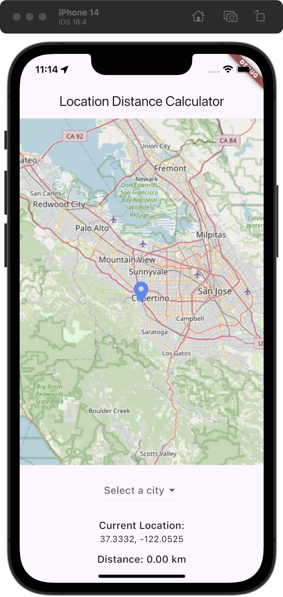
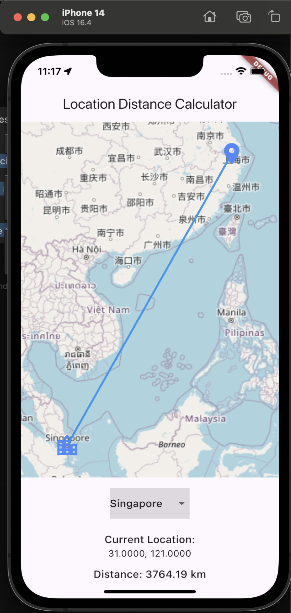

# location_distance_calculator

## Product Requirements:

1. Displays the user’s last known location 
2. Asks the user to pick one of the following cities:  Chicago, New York, Paris, Singapore
3. Calculates and displays the distance from #1 to the city picked in #2

Feel free to use any 3rd party library to solve the problem.

## Please notice that:

1. User's last known locations is get by `Geolocator` package. when app starts, it will ask for permission to get user's location.
2. I was planning to use google map but it requires API key, so I use `flutter_map` package to display map and `latlong2` package to calculate the distance.

## Basic Usage(Testcase)

1. Open App, display current location on the map

2. Select city from the bottom sheet, and display the distance to the city

3. Select a city, then change to another city, the distance will be updated

[check video](./assets/Simulator%20Screen%20Recording%20-%20iPhone%2014%20-%202024-09-02%20at%2011.20.25.mp4)